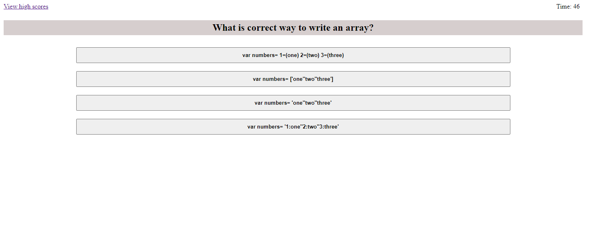

# code-quiz
## Description
The purpose of this application is to generate a timed quiz.

## Table of Contents

* [Installation](#installation)
* [Usage](#usage)
* [Credits](#credits)
* [License](#license)

## Installation

The project is viewable at the project's github pages.

URL of deployed application: https://armcuellar.github.io/code-quiz/

## Usage
This quiz can be used to practice concepts. The arrays in the quiz can also be easily modified to ask other questions.

## Credits

[Armando Cuellar](https://github.com/armcuellar) 

## License

Licencsed under [MIT License](LICENSE)